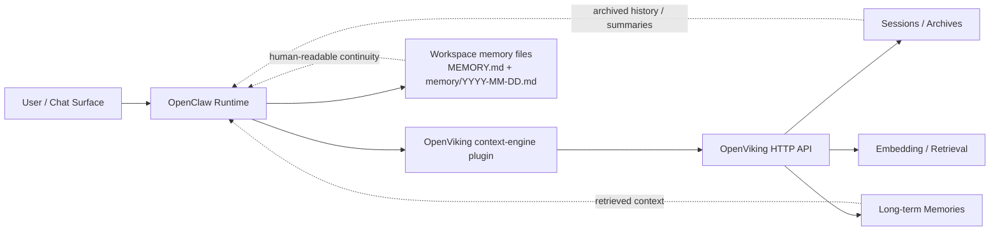

# OpenClaw + OpenViking Ultimate Setup

[中文说明 / Chinese README](./README_zh.md)

A practical, beginner-friendly guide for turning **OpenClaw** and **OpenViking** into one working stack.

This repo is based on a real successful setup, but the goal here is not to brag about one lucky run. The goal is simpler: make the integration understandable, reproducible, and much less annoying for the next person.

## What this repo is

This is an **integration starter** for:

- installing or connecting OpenViking
- wiring OpenViking into OpenClaw as the context engine
- enabling `autoRecall` and `autoCapture`
- verifying that the whole thing is actually alive
- explaining what is truly working vs what still needs separate validation

## What this repo is not

It is **not**:

- official OpenClaw documentation
- official OpenViking documentation
- a fake “AI memory solved forever” landing page
- a guaranteed all-platform installer for every environment on earth

It is a practical field guide plus a few useful scripts.

## Architecture

The high-level relationship is this:



More detail: see [docs/architecture.md](./docs/architecture.md).

## Official docs you should keep nearby

### OpenClaw

- OpenClaw docs: <https://docs.openclaw.ai>
- OpenClaw install docs: <https://docs.openclaw.ai/install>
- OpenClaw installer docs: <https://docs.openclaw.ai/install/installer>
- OpenClaw macOS docs: <https://docs.openclaw.ai/platforms/macos>

### OpenViking

- OpenViking GitHub: <https://github.com/volcengine/OpenViking>
- OpenViking plugin / integration docs usually live in the upstream OpenViking repo under the OpenClaw plugin examples and install docs.

This repo is meant to complement those docs, not replace them.

## Choose your path

There are two main routes.

### Path A — You already have OpenViking running

Use this when:

- OpenViking is already installed
- you already have an API key if needed
- your server is reachable, for example at `http://127.0.0.1:1933`

This is the fastest path and the one this repo currently supports best.

### Path B — You do **not** have OpenViking yet

Use this when:

- you want a full OpenClaw + OpenViking setup from near-zero
- you still need to install the OpenViking side first
- you want a more step-by-step beginner flow

This repo gives you the structure, links, and integration flow for that route, but the actual OpenViking installation still follows upstream docs and tooling.

## Step 1 — Install OpenClaw

If you do not already have OpenClaw, install it first.

Use the official docs:

- <https://docs.openclaw.ai/install>
- <https://docs.openclaw.ai/install/installer>

After install, make sure this works:

```bash
openclaw status
```

If that command is dead or weird, don’t keep stacking problems. Fix OpenClaw first.

## Step 2 — Decide whether OpenViking already exists

### If OpenViking is already installed

Make sure you know:

- the OpenViking base URL, for example `http://127.0.0.1:1933`
- the API key if your server requires one
- the agent ID you want to use, usually `default`

Also check that the server is alive:

```bash
curl http://127.0.0.1:1933/health
```

### If OpenViking is not installed yet

Go install OpenViking first using upstream docs and tooling.

Recommended upstream starting points:

- OpenViking repo: <https://github.com/volcengine/OpenViking>
- upstream install docs / plugin docs in that repo

What you want, at minimum, before coming back here:

- a running OpenViking service
- a reachable HTTP endpoint
- service-side config handled on the OpenViking side
- any required API key prepared

Once that exists, come back and continue with Step 3.

## Step 3 — Wire OpenViking into OpenClaw

This repo includes a simple remote-mode bootstrap:

```bash
git clone https://github.com/dx47618004/openclaw-openviking-one-click.git
cd openclaw-openviking-one-click
chmod +x scripts/install.sh scripts/verify.sh
./scripts/install.sh --api-key YOUR_OPENVIKING_API_KEY
```

If your OpenViking endpoint is not the default local one:

```bash
./scripts/install.sh \
  --api-key YOUR_OPENVIKING_API_KEY \
  --openviking-url http://127.0.0.1:1933 \
  --agent-id default \
  --config ~/.openclaw/openclaw.json
```

### What the script configures

It patches OpenClaw so that:

- `plugins.entries.openviking.enabled = true`
- `plugins.entries.openviking.config.mode = remote`
- `plugins.entries.openviking.config.baseUrl = ...`
- `plugins.entries.openviking.config.autoRecall = true`
- `plugins.entries.openviking.config.autoCapture = true`
- `plugins.slots.contextEngine = openviking`

Then it restarts the OpenClaw gateway.

## Step 4 — Verify that it really works

Run:

```bash
./scripts/verify.sh
```

And also:

```bash
openclaw status
```

A useful successful state usually includes most or all of these:

- OpenClaw gateway is healthy
- OpenViking plugin is loaded
- `contextEngine` is `openviking`
- OpenViking is reachable
- recall and capture are enabled in config

## What this setup actually proves

If the above checks pass, you can reasonably say:

- OpenClaw is talking to OpenViking
- OpenViking is acting as the context engine
- session capture is happening
- recall hooks are in place
- the integration path is real, not imaginary

## What this setup does **not** automatically prove

This is the part people constantly muddle.

It does **not** automatically prove that:

- long-term memory extraction is already producing high-value memories
- every memory category is filling correctly
- rerank is configured
- your extraction quality is already “production perfect”

The important distinction is:

1. plugin wired correctly
2. session capture / recall working
3. archive + extraction pipeline fully validated

Those are related, but they are not the same milestone.

## Why the workspace memory files still matter

Even with OpenViking attached, these files still matter a lot:

- `MEMORY.md`
- `memory/YYYY-MM-DD.md`

Why? Because they are:

- human-readable
- easy to inspect
- easy to curate
- the cleanest continuity layer when you want explicit durable notes

So the practical architecture is not “OpenViking replaces files.”
It is closer to:

- OpenClaw runtime
- OpenViking as context / session / archive / memory backend
- workspace Markdown files as the most direct human-readable memory layer

## Troubleshooting

### OpenClaw keeps loading forever after enabling OpenViking

Check these first:

- is the OpenViking service alive?
- is `baseUrl` correct?
- is `plugins.allow` including `openviking`?
- is `plugins.slots.contextEngine = openviking`?
- did you accidentally break `~/.openclaw/openclaw.json`?

### Recall is not happening

Check:

- plugin load state in `openclaw status`
- `autoRecall`
- OpenViking server health
- routing / plugin logs if enabled

### Session capture happens but memories seem empty

That may be an extraction / commit issue rather than a transport issue.

In plain English:

- messages may already be landing in session storage
- but structured long-term memories may still need further validation or explicit commit / extraction confirmation

## Repo structure

```text
.
├── README.md
├── README_zh.md
├── CHANGELOG.md
├── ROADMAP.md
├── docs/
│   └── architecture.md
└── scripts/
    ├── install.sh
    └── verify.sh
```

## Roadmap

See [ROADMAP.md](./ROADMAP.md).

Short version:

- better from-scratch flow
- Linux-tested instructions
- Docker / Compose examples
- more verification artifacts
- a clearer extraction-validation helper

## License

MIT, for the repo contents.
