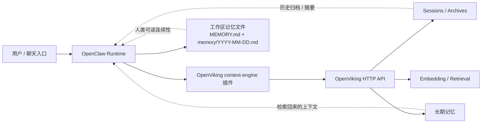

# OpenClaw + OpenViking 终极整合方案

[English README](./README.md)

这是一个面向小白、尽量傻瓜式、尽量一步一步来的 **OpenClaw + OpenViking 整合说明**。

它基于一次真实成功跑通的现场经验整理，但目的不是炫耀“我这机子成了”。目的很简单：把这套整合写清楚、拆清楚、尽量让后来的人少踩坑。

## 先看这里

如果你只先看一个部分，就先看这段。

### 路线 1：你已经装好了 OpenViking

这仓库可以直接当你的主接线说明。

推荐顺序：

1. 先读这份 README
2. 再跑 `scripts/install.sh`
3. 再跑 `scripts/verify.sh`
4. 再看 [docs/verification.md](./docs/verification.md)
5. 再拿 [docs/known-good-example.md](./docs/known-good-example.md) 对照你的状态
6. 最后再谈 extraction 到底算不算真的被证明了

### 路线 2：你还没装 OpenViking

别一上来就直接跑接线脚本。

推荐顺序：

1. 先按官方文档安装 OpenClaw
2. 再按上游文档安装 OpenViking
3. 再看 [docs/install-from-scratch.md](./docs/install-from-scratch.md)
4. 然后再回来做接线和验证

这个分流很重要，因为“后端压根没装”跟“整合接坏了”根本不是一类问题。

## 这个仓库是干嘛的

它主要解决的是：

- 怎么安装或接入 OpenViking
- 怎么把 OpenViking 接进 OpenClaw 作为 context engine
- 怎么开启 `autoRecall` 和 `autoCapture`
- 怎么确认这玩意儿不是“看起来像成功”而是真的通了
- 怎么区分“已经接线成功”和“长期记忆抽取已经完全验证”这两件事

## 它不是什么

它**不是**：

- OpenClaw 官方文档
- OpenViking 官方文档
- 那种张嘴就来“AI Memory 从此改变世界”的营销页
- 一个已经覆盖所有平台、所有环境、所有奇葩网络情况的万能安装器

它更像是：**实战集成说明 + 一点能直接拿来用的脚本**。

## 架构图

先看最关键的一张图，别上来就被一堆名词绕晕。



更详细的说明见：[docs/architecture.md](./docs/architecture.md)

验证边界和“到底证明了什么/没证明什么”，单独看这里：[docs/verification.md](./docs/verification.md)

已知正常状态长什么样，直接对照这里：[docs/known-good-example.md](./docs/known-good-example.md)

如果你是从 0 开始装，直接看这里：[docs/install-from-scratch.md](./docs/install-from-scratch.md)

如果你已经卡住了，直接看故障矩阵：[docs/troubleshooting.md](./docs/troubleshooting.md)

## 官方文档入口

### OpenClaw

- OpenClaw 文档：<https://docs.openclaw.ai>
- OpenClaw 安装文档：<https://docs.openclaw.ai/install>
- OpenClaw Installer 文档：<https://docs.openclaw.ai/install/installer>
- OpenClaw macOS 文档：<https://docs.openclaw.ai/platforms/macos>

### OpenViking

- OpenViking GitHub：<https://github.com/volcengine/OpenViking>
- OpenViking 的安装说明 / OpenClaw 插件相关说明，通常以上游仓库中的文档为准

这仓库是拿来**补强实战接线体验**的，不是替代上游文档的。

## 先选路线

你先别一股脑往下冲。先看你属于哪种情况。

### 路线 A：你已经装好了 OpenViking

适合这种情况：

- OpenViking 已经安装好了
- 你已经有 API key（如果服务需要）
- 你已经有一个能访问的 OpenViking HTTP 地址，比如 `http://127.0.0.1:1933`

这条路线是目前这个仓库最成熟、最直接支持的路线。

### 路线 B：你还没装 OpenViking

适合这种情况：

- 你想从接近 0 开始搭 OpenClaw + OpenViking
- OpenViking 还没装
- 你希望看的是一步一步的终极傻瓜说明

这条路线里，这个仓库会给你：

- 总体步骤
- 分叉说明
- OpenClaw 与 OpenViking 的职责边界
- OpenClaw 侧接线脚本

但 **OpenViking 本体的安装** 还是要按上游文档来。

## Step 1：先把 OpenClaw 装好

如果你还没装 OpenClaw，先按官方文档装。

看这里：

- <https://docs.openclaw.ai/install>
- <https://docs.openclaw.ai/install/installer>

装完先别急着接 OpenViking，先自己验一下：

```bash
openclaw status
```

如果这里都不正常，就别继续叠 bug 了，先把 OpenClaw 自己弄正常。

## Step 2：确认你有没有现成的 OpenViking

### 情况 1：你已经有 OpenViking

你至少要搞清楚这几个东西：

- OpenViking base URL，比如 `http://127.0.0.1:1933`
- API key（如果需要）
- 你想用的 agent ID，通常可以先用 `default`

最好顺手验一下服务活没活：

```bash
curl http://127.0.0.1:1933/health
```

### 情况 2：你还没有 OpenViking

那你先去按上游文档把 OpenViking 装起来。

推荐入口：

- OpenViking 仓库：<https://github.com/volcengine/OpenViking>

你至少要先做到这些，再回来继续：

- OpenViking 服务能跑起来
- 你有一个可访问的 HTTP endpoint
- OpenViking 服务侧配置已经处理好
- 该准备的 API key 已经准备好

然后再进入 Step 3。

## Step 3：把 OpenViking 接进 OpenClaw

这个仓库里带了一个最小远程模式接线脚本。

```bash
git clone https://github.com/dx47618004/openclaw-openviking-one-click.git
cd openclaw-openviking-one-click
chmod +x scripts/install.sh scripts/verify.sh
./scripts/install.sh --api-key YOUR_OPENVIKING_API_KEY
```

如果你的 OpenViking 地址不是默认本地地址：

```bash
./scripts/install.sh \
  --api-key YOUR_OPENVIKING_API_KEY \
  --openviking-url http://127.0.0.1:1933 \
  --agent-id default \
  --config ~/.openclaw/openclaw.json
```

## Step 4：这个脚本到底会干什么

它会把 OpenClaw 改成大致下面这套状态：

- `plugins.entries.openviking.enabled = true`
- `plugins.entries.openviking.config.mode = remote`
- `plugins.entries.openviking.config.baseUrl = ...`
- `plugins.entries.openviking.config.autoRecall = true`
- `plugins.entries.openviking.config.autoCapture = true`
- `plugins.slots.contextEngine = openviking`

然后它会尝试重启 OpenClaw gateway。

## Step 5：验证别装死

跑：

```bash
./scripts/verify.sh
```

再跑：

```bash
openclaw status
```

更像样的成功状态，至少应该尽量满足这些：

- OpenClaw gateway 健康
- OpenViking 插件已加载
- `contextEngine` 已经是 `openviking`
- OpenViking endpoint 可达
- recall / capture 在配置里已经打开

然后拿 [docs/known-good-example.md](./docs/known-good-example.md) 对一遍。

如果你想把“接线成功”和“长期记忆已经完全验证”这两件事分开讲清楚，直接看 [docs/verification.md](./docs/verification.md)。

## 这一步到底证明了什么

如果上面的检查都通过，你基本可以认为这些事情已经成立：

- OpenClaw 确实在跟 OpenViking 对话
- OpenViking 已经作为 context engine 接进来了
- session capture 在发生
- recall 相关钩子已经接上
- 这不是“看起来没报错”那种假成功

## 但这一步**还没有自动证明**什么

这是最容易被人混淆的地方。

它**没有自动证明**：

- 长期记忆抽取一定已经高质量产出
- 每一类 memory 都已经开始稳定沉淀
- rerank 一定已经配置好了
- 记忆效果已经到了“生产级完美”

你至少要把这三层分开看：

1. 插件接线是否正确
2. session capture / recall 是否在工作
3. archive + extraction 是否已经完全验证

它们相关，但不是一回事。

## 为什么工作区里的记忆文件依然很重要

哪怕接上了 OpenViking，这些文件依然很重要：

- `MEMORY.md`
- `memory/YYYY-MM-DD.md`

因为它们有几个硬好处：

- 人类可读
- 好检查
- 好整理
- 真要看长期连续性时，最直接

所以实际结构不是“OpenViking 把文件替代了”。

更准确的说法是：

- OpenClaw 是主运行时
- OpenViking 是上下文 / session / archive / memory 后端
- 工作区 Markdown 文件是最直接、最稳的人类可读连续性层

## 故障排查

### 开启 OpenViking 后，OpenClaw 一直 loading 或表现诡异

先检查这些：

- OpenViking 服务是不是活着
- `baseUrl` 对不对
- `plugins.allow` 里有没有 `openviking`
- `plugins.slots.contextEngine` 是不是 `openviking`
- `~/.openclaw/openclaw.json` 有没有被你改坏

### 没看到 recall

检查：

- `openclaw status` 里插件是否已加载
- `autoRecall` 是否开启
- OpenViking 服务是否健康
- 插件 / 路由日志（如果你开了）
- 你的测试短语是不是足够独特，能证明真 recall，而不是瞎猜

### session 在写，但 memory 看起来还是空的

这更像是 extraction / commit 问题，不一定是接线问题。

说人话就是：

- 消息可能已经进 session 了
- 但结构化长期记忆不一定已经沉淀出来

如果你想按症状一格一格排，直接看 [docs/troubleshooting.md](./docs/troubleshooting.md)。
如果你想对照一个正常样子，直接看 [docs/known-good-example.md](./docs/known-good-example.md)。

## 仓库结构

```text
.
├── README.md
├── README_zh.md
├── CHANGELOG.md
├── ROADMAP.md
├── docs/
│   ├── architecture.md
│   ├── install-from-scratch.md
│   ├── known-good-example.md
│   ├── troubleshooting.md
│   └── verification.md
└── scripts/
    ├── install.sh
    └── verify.sh
```

## 接下来还值得继续补什么

看 [ROADMAP.md](./ROADMAP.md)

短版就是：

- 更完整的从零搭建路线
- Linux 实测说明
- Docker / Compose 示例
- 更完整的验证材料
- 更明确的 extraction 验证脚本
- 已知正常状态的截图 / 状态快照

## License

仓库内容使用 MIT。
