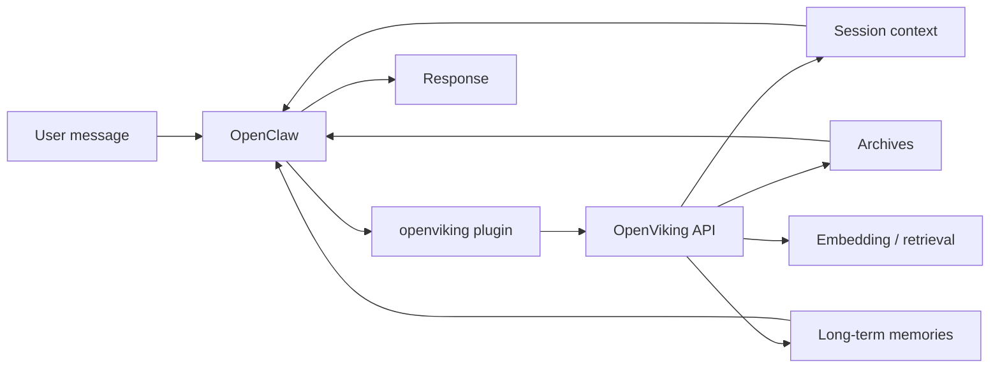

# Architecture

This repo uses a very simple mental model:

## One sentence version

**OpenClaw is the runtime. OpenViking is the context and memory backend. Workspace Markdown files remain the clearest human-readable continuity layer.**

## Core flow

## Read path

When a new user message arrives:

1. OpenClaw receives the message
2. the `openviking` context-engine plugin is invoked
3. the plugin calls OpenViking over HTTP
4. OpenViking searches session context, archives, and memory storage
5. relevant context is returned to OpenClaw
6. OpenClaw builds the prompt and responds

## Write path

After a turn:

1. OpenClaw finishes the turn
2. the plugin appends new turn content to the OpenViking session
3. depending on session state and thresholds, archive / extraction work may happen
4. future turns can retrieve that accumulated context

## Human-readable memory still matters

OpenViking is excellent as a backend, but the workspace files still matter:

- `MEMORY.md`
- `memory/YYYY-MM-DD.md`

They are:

- explicit
- easy to inspect
- easy to edit
- good for durable continuity that humans can audit quickly

## Practical takeaway

Do not think of this stack as “OpenViking replaces files.”

Think of it as:

- OpenClaw runs the conversation and tools
- OpenViking helps with recall, sessions, archives, and memory storage
- workspace files remain the simplest source of truth for durable, human-readable continuity
